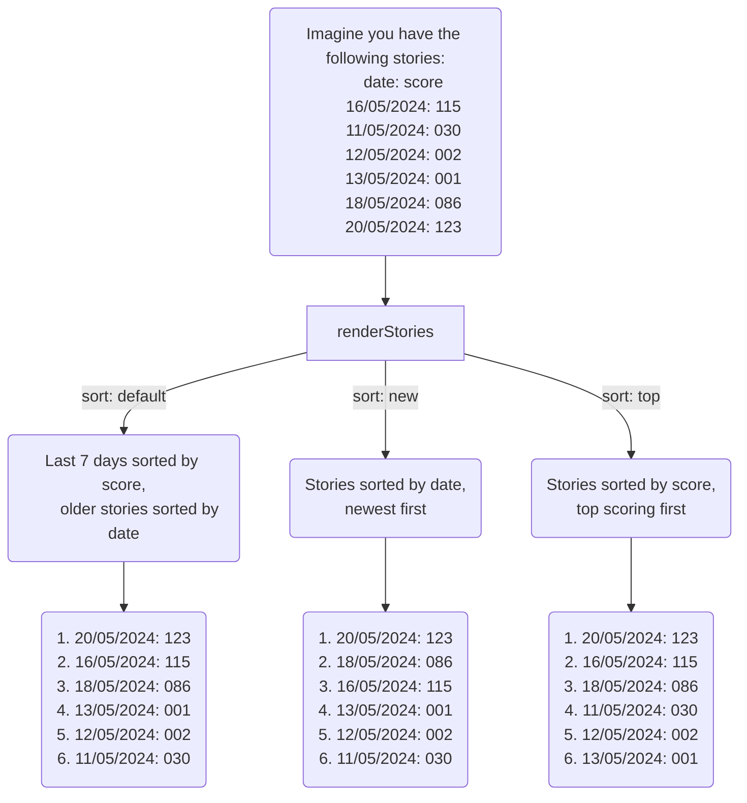

# simple-link-aggregator

A simple link aggregator built to work with a custom backend, or a backend powered by AppsScript.

## Install

```bash
npm install simple-link-aggregator
```

## Usage

The idea is to have a backend that stores each story, then use this library to render the frontend and use a url for handling sorting by topic or domain, and a `POST` request for upvoting.

### Generating client side html

`renderStories` should be your main entry point in the [story.ts](./src/story.ts) folder.

```typescript
const stories = [
  Story(
    1,
    new Date(),
    "https://github.com/eeue56/jump-to/",
    "Click on links without needing to leave the keyboard",
    ["Workflow"],
    "A Vimium inspired keyboard shortcut script for browsers. Highlights all clickable elements on a page, then provides shortcuts to click them so you never have to leave your keyboard again!",
    "A handy way to learn about making Chrome extensions, testing them with Playwright, and using JSDoc",
    1
  ),
];

const storyHtml = renderStories(stories, "default", "/upvote", "/topic", "/domain");
```

The CSS and JS needed is included when using `renderStories`. If the `google` window object exists, then it will use `google.script.run.upvoteStory(storyId: string)` to handle the upvoting. Otherwise, it defaults to a `POST` via fetch.

### AppsScript backend

If you want to hook this up to AppsScript, then create an AppsScript attachment to a spreadsheet. Write a function to get all the stories, then add `doGet` and deploy as a web app. I recommend using the caching service too. You'll also want `upvoteStory(storyId: string)`, which is the default thing called in the client-side js if the `google` (more specifically: `google.script.run`) script exists.

Here's an example:

```typescript
import { story } from "simple-link-aggregator";

function getStories(): story.Story[] {}

export function doGet(
  event: GoogleAppsScript.Events.DoGet
): GoogleAppsScript.HTML.HtmlOutput {
  let pathInfo = "/";
  if (!event.pathInfo) {
    pathInfo = "/";
  } else {
    pathInfo = `/${event.pathInfo}`;
  }

  console.log("Using path", pathInfo);

  let cachedPage = cache.get(pathInfo);
  if (cachedPage === null) {
    console.log("Cache is empty, populating...");
    cachedPage = doGetCached(pathInfo);
    cache.put(pathInfo, cachedPage, 60 * 5);
  }

  return HtmlService.createHtmlOutput(cachedPage).addMetaTag(
    "viewport",
    "width=device-width, initial-scale=1.0"
  );
}

function getScriptUrl(): string {
  var url = ScriptApp.getService().getUrl();
  return url;
}

function doGetCached(pathInfo: string): string {
  const index = `<!DOCTYPE html>
<html>
  <head>
    <base target="_top">
  </head>
  <body>{contents}</body>
</html>`;
  const baseUrl = getScriptUrl();

  let stories = getStories();
  let sort: "default" | "new" | "top" = "default";

  const root = matches(/\/$/, pathInfo);
  const topic = matches(/\/topic\/(.+)$/, pathInfo);
  const domain = matches(/\/domain\/(.+)$/, pathInfo);
  const new_ = matches(/\/new$/, pathInfo);
  const top = matches(/\/top$/, pathInfo);

  if (root) {
  } else if (topic) {
    stories = stories.filter((story) => story.topic.includes(topic[1]));
  } else if (domain) {
    stories = stories.filter((story) => story.link.includes(domain[1]));
  } else if (new_) {
    sort = "new";
  } else if (top) {
    sort = "top";
  }

  return index.replace(
    "{contents}",
    story.renderStories(
      stories,
      sort,
      `${baseUrl}/upvote`,
      `${baseUrl}/topic`,
      `${baseUrl}/domain`
    )
  );
}

// you may want this in a separate file
function upvoteStory(storyId) {
    // grab the current score and increment it in the spreadsheet
}

```

### Suggested backend server API

There isn't a backend server included, but this is the API I'd recommend.

|url format|output|format|
|:---:|:---:|:---:|
|`/`| Last 7 days sorted by score - older stories sorted by date| `GET` |
|`/new`| Stories sorted by date - newest first| `GET` |
|`/top`| Stories sorted by score - top scoring first| `GET` |
|`/topic/:topic`| Only fetch articles with that topic| `GET` |
|`/domain/:domain`| Only fetch articles with that domain| `GET` |
|`/upvote/:story_id`| Upvote that story, and return the new count| `POST` |

For a comprenhensive example, check out the [example](./example/) folder that implements this (without a permanent data store) that also happens to have all the tests.

## Stories

Every submission is made up of stories. Every story is a link, with a title, a summary, and a description of how it relates to the reader. For more details, [this blog post](https://thetechenabler.substack.com/p/streamlining-technology-news-for) covers why we'd want that.

|sort|output|
|:---:|:---:|
|default| Last 7 days sorted by score - older stories sorted by date|
|new| Stories sorted by date - newest first|
|top| Stories sorted by score - top scoring first|

A visualization of how that looks, on the date 20/05/2024 (en_GB format):



### Novelities

Because AppsScript's runtime has some quirks (like not support `URL`), and the Web App is also weird (`iframe`), this project does some strange things. In particular:
- Re-implementing hostname parsing in strings.
- Detecting if the script is being run from an AppsScript, switching between AppsScript's remote function calls to a simple fetch request if not.
- Avoid as many imports as possible, as deploying packages with imports on AppsScript complicates things.
- Avoid reading files, prefering to do replacements as part of the [build](./build.py) step.
- Remain backend agnositic.